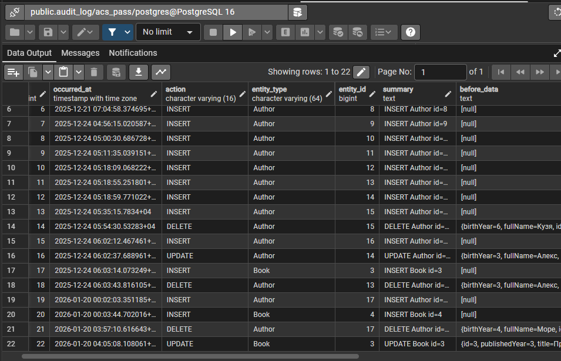
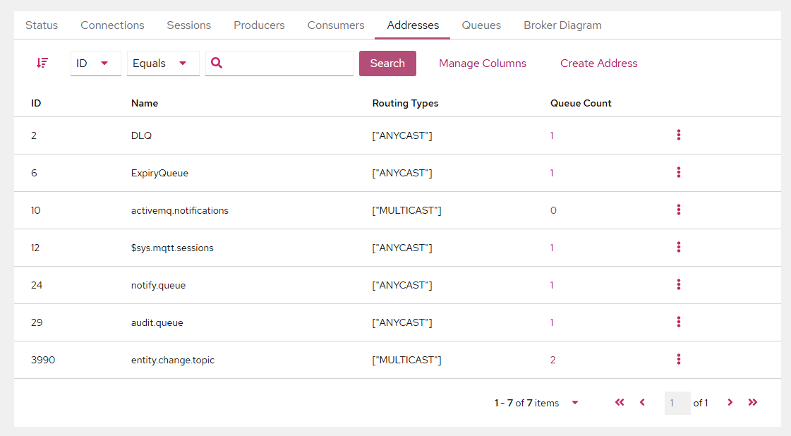
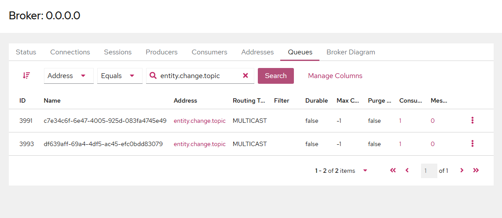
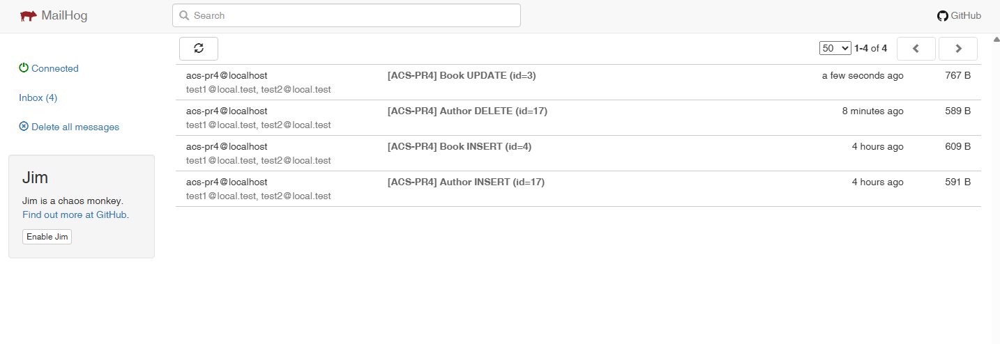

# ACS PR4 — JMS (Audit Log + Email Notifications) поверх REST API (Authors & Books)

**Дисциплина:** Архитектура корпоративных систем  
**Команда:** FSIS (Асташин С.В и Журавлев Н.С.)  
**Группа:** 6133-010402D  

Практическая работа №4: добавлен механизм журналирования изменений (**audit_log**) и система email‑оповещений через **JMS (ActiveMQ Artemis)**.

---

## Стек
- Java 17
- Spring Boot
- Spring Web (REST)
- Spring Data JPA + Hibernate
- Flyway
- PostgreSQL
- JMS: ActiveMQ Artemis
- Email: MailHog (SMTP)
- Swagger/OpenAPI

---

## 1) Предварительные требования

Установить/иметь:
- Java 17
- Maven
- PostgreSQL (локально)
- (опционально) Docker — если запускаете Artemis/MailHog через Docker

---

## 2) Настройка базы данных (PostgreSQL)

Создайте БД и пользователя (пример):

```sql
CREATE DATABASE acs_pass;
CREATE USER acs_user WITH PASSWORD 'acs_pass';
GRANT ALL PRIVILEGES ON DATABASE acs_pass TO acs_user;
```

В `src/main/resources/application.properties` должны быть корректные данные подключения:

```properties
spring.datasource.url=jdbc:postgresql://localhost:5432/acs_pass
spring.datasource.username=acs_user
spring.datasource.password=acs_pass
```

Flyway при запуске сам применит миграции и создаст таблицы, включая `audit_log`.

---

## 3) Запуск ActiveMQ Artemis и MailHog

### Вариант A: запуск через Docker (как в моём запуске)

#### 3.1 MailHog (SMTP + Web UI)

```bash
docker run -d --name mailhog   -p 1025:1025 -p 8025:8025   mailhog/mailhog
```

MailHog UI: `http://localhost:8025`

#### 3.2 ActiveMQ Artemis (JMS + Web Console)

Обычно (если порты свободны):

```bash
docker run -d --name artemis   -e ARTEMIS_USER=admin -e ARTEMIS_PASSWORD=admin   -p 61616:61616 -p 8161:8161   apache/activemq-artemis:2.41.0-alpine
```

Artemis Console: `http://localhost:8161`  
Логин/пароль: `admin / admin`

##### Если на Windows порт “запрещён/занят системой”
Иногда Windows резервирует диапазон портов, и Docker не может забиндить `61616` (ошибка вида “An attempt was made to access a socket in a way forbidden…”).

Тогда используйте один из вариантов:

**Вариант 1 (рекомендуется): выбрать другой внешний порт**

```bash
docker run -d --name artemis   -e ARTEMIS_USER=admin -e ARTEMIS_PASSWORD=admin   -p 61630:61616 -p 8162:8161   apache/activemq-artemis:2.41.0-alpine
```

**Вариант 2: отдать внешний порт Docker’у автоматически**
(тогда внешний порт будет случайный)

```bash
docker run -d --name artemis   -e ARTEMIS_USER=admin -e ARTEMIS_PASSWORD=admin   -p 8162:8161   -p 127.0.0.1::61616   apache/activemq-artemis:2.41.0-alpine
```

Посмотреть, какой внешний порт выдался:

```bash
docker port artemis 61616
```

---

### Вариант B: запуск без Docker (локально)

#### 3.1 ActiveMQ Artemis без Docker
1) Скачайте ActiveMQ Artemis (дистрибутив).  
2) Создайте брокер:

```bash
./artemis create mybroker
```

3) Запустите:

```bash
cd mybroker/bin
./artemis run
```

Обычно используются порты:
- 61616 (JMS)
- 8161 (web console)

#### 3.2 MailHog без Docker
1) Скачайте MailHog (бинарник под вашу ОС) из релизов.  
2) Запуск:

```bash
MailHog
```

Порты по умолчанию:
- SMTP: 1025
- Web UI: 8025

---

## 4) Настройки приложения

Ключевые параметры `src/main/resources/application.properties`:

```properties
spring.application.name=acs-pr4

spring.datasource.url=jdbc:postgresql://localhost:5432/acs_pass
spring.datasource.username=acs_user
spring.datasource.password=acs_pass

spring.jpa.hibernate.ddl-auto=validate
spring.jpa.open-in-view=false

spring.flyway.enabled=true
spring.flyway.locations=classpath:db/migration

# --- JMS (ActiveMQ Artemis) ---
spring.artemis.mode=native
spring.artemis.broker-url=tcp://127.0.0.1:61616
spring.artemis.user=admin
spring.artemis.password=admin

# ОДИН Topic для событий изменений (pub/sub)
app.jms.change-topic=entity.change.topic

# --- Email (MailHog) ---
spring.mail.host=127.0.0.1
spring.mail.port=1025
spring.mail.properties.mail.smtp.auth=false
spring.mail.properties.mail.smtp.starttls.enable=false
spring.mail.test-connection=true
spring.mail.properties.mail.debug=true

app.notify.enabled=true
app.notify.from=acs-pr4@localhost
app.notify.to=test1@local.test,test2@local.test
app.notify.subject-prefix=[ACS-PR4]

logging.level.org.springframework.jms=INFO
logging.level.org.springframework.mail=DEBUG
logging.level.org.eclipse.angus.mail=DEBUG
logging.level.com.example.demo=DEBUG
```

### Важно про `spring.artemis.broker-url`
Если Artemis запущен с нестандартным/случайным внешним портом — **укажите его в `broker-url`**.

Пример: если команда `docker port artemis 61616` показывает `127.0.0.1:50634`, то:

```properties
spring.artemis.broker-url=tcp://127.0.0.1:50634
```

---

## 5) Запуск приложения

В корне проекта:

```bash
mvn clean spring-boot:run
```

Swagger UI:
- `http://localhost:8080/swagger-ui.html`

---

## 6) Проверка работоспособности лабораторной

### 6.1 Проверка CRUD и генерации событий (REST)

Проверьте через Swagger (`/swagger-ui.html`) или любым REST‑клиентом (Postman/curl).

Пример: **создание автора**  
`POST /api/authors`

```json
{
  "fullName": "Иван Иванов",
  "birthYear": 1990
}
```

Пример: **обновление автора**  
`PUT /api/authors/{id}`

```json
{
  "fullName": "Иван Иванович",
  "birthYear": 1991
}
```

Пример: **удаление автора**  
`DELETE /api/authors/{id}`

Ожидаем после каждой операции (INSERT/UPDATE/DELETE):
- приложение публикует событие **в Topic** `${app.jms.change-topic}`
- **AuditLogListener** получает событие и пишет строку в `audit_log`
- **NotifyEmailListener** получает событие и отправляет письмо в MailHog

---

### 6.2 Проверка таблицы `audit_log` (PostgreSQL)

```sql
SELECT id, occurred_at, action, entity_type, entity_id, summary, before_data, after_data
FROM audit_log
ORDER BY occurred_at DESC;
```

📸 **Скриншот 1:** `docs/screenshots/audit-log.png`



---

### 6.3 Проверка Artemis: Topic (pub/sub) и подписчики

Открыть Artemis Console:
- `http://localhost:8161` (или другой порт, если вы маппили иначе)




---

### 6.4 Проверка MailHog (письма)

MailHog UI:
- `http://localhost:8025`

📸 **Скриншот 4:** `docs/screenshots/mailhog.png`



---

## 7) Полезные ссылки
- Swagger: `http://localhost:8080/swagger-ui.html`
- Artemis Console: `http://localhost:8161` (или ваш порт)
- MailHog UI: `http://localhost:8025`
